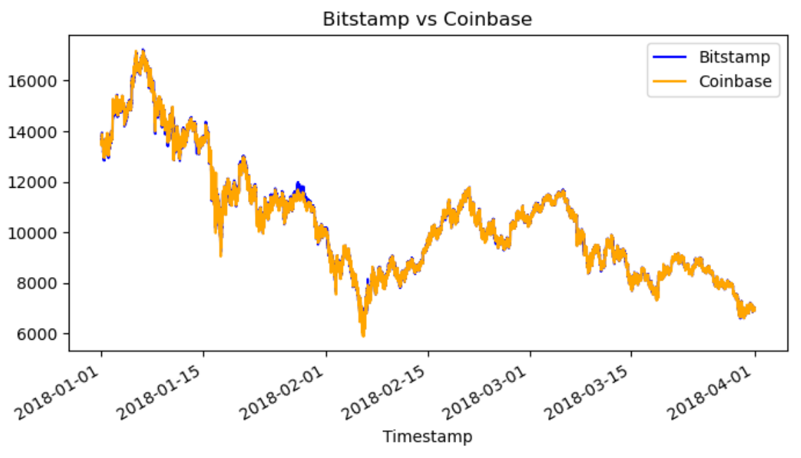
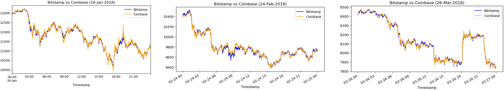
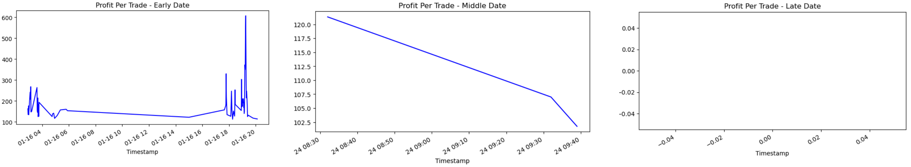
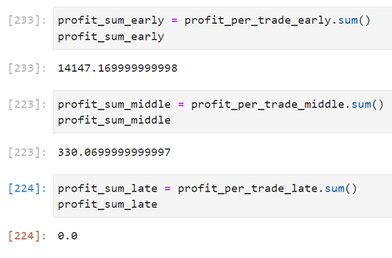

# Crypto Arbitrage Report

This project sorts through historical trade data for Bitcoin on two exchanges: Bitstamp and Coinbase. Three phases of financial analysis to determine if any arbitrage opportunities have existed for Bitcoin:

* Data collection (trading data from both exchanges from 1-Jan-18 to 31-Mar-18)
* Data cleaning and preparation
* Data analysis

The report then provides some qualitative insights based on the data, analysing if there were arbitrage opportunities, when and what size.

---

## Technologies

The whole project is implemented in Python, writen in Jupyter lab using the Pandas library and matplotlib for plotting: 

* ```import pandas as pd```
* ```from pathlib import Path```
* ```%matplotlib inline```

The main ```crypto_arbitrage.ipynb``` file reads from the csv files contained in the 'Resources' folder.

---

## Usage

Run the main ```crypto_arbitrage.ipynb``` from the console. You will get the full arbitrage analysis report and can read the main conclusions marked-down in the comments along the descriptive charts. 

The trading activity in both exchanges is plotted and analysed for the whole quarter:



And also in specific points: early, middle and late:



Then the trading arbitrage amounts are calculated on each of them with 2 conditions: being >0 and >1% (to take trading fees into account):




The main conclusion from this report is that both the number of arbitrage opportunities and their size declined significantly and abruptly from the early to the late dates. When checking the trading volumes for those dates, it is clear that they were a lot lower also in the later dates, probably due to the bad performance of the assets along the period (progressive loss of trading interest). In the case of the 24th of Feb, it was also a Saturday (less active trading day).

---

## Contributors

Feature developed by Lourdes Dominguez [(LinkedIn profile)](https://www.linkedin.com/in/lourdes-dominguez-bengoa-12333044/)

---

## License

Use only for academic purposes.
